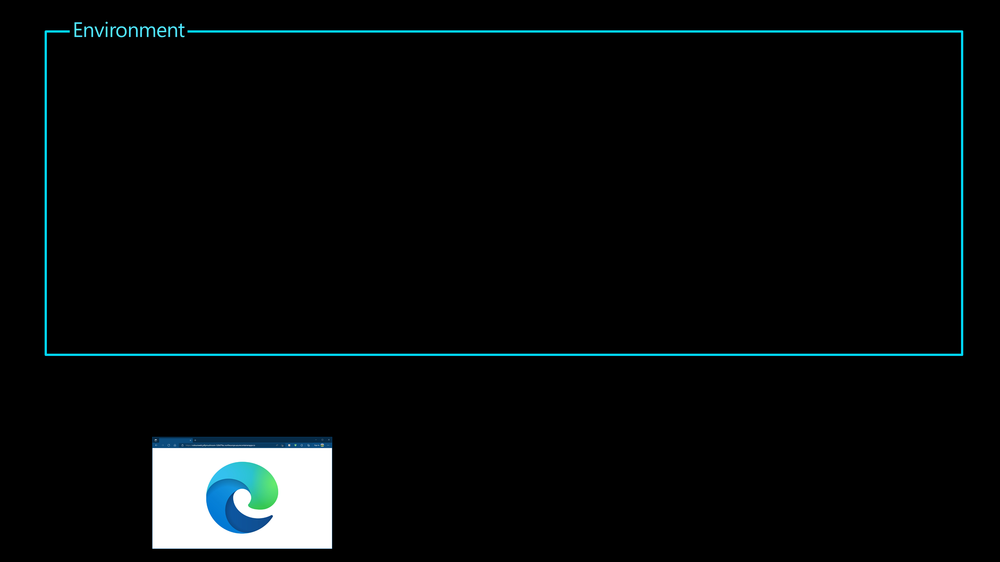
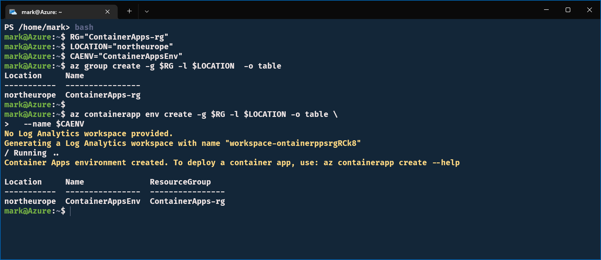
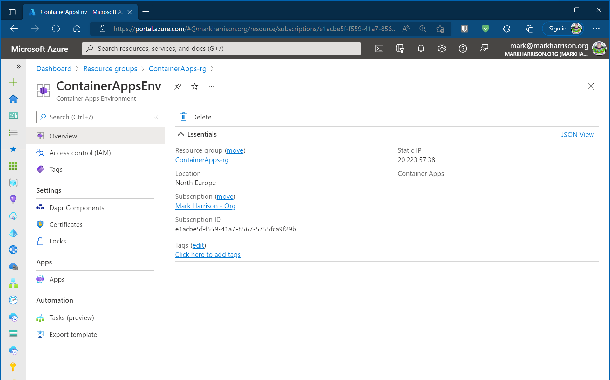

# Create Container Apps Environment

## Objective

Applications are deployed to a single Container Apps Environment, which acts as a secure boundary around groups of Container Apps. Container Apps in the same environment are deployed in the same virtual network and write logs to the same Log Analytics workspace.

In this section we will create a Container Apps Environment.



## Lab Script

### Logon to Azure and Initialise 

Enter the following - commands below assume using the Bash command language. 

- Logon to Azure (this is not needed if using cloud shell).  
- Check using using the correct subscription.  
- The other commands maybe needed once depending on what has been previously installed. 

```
az login
az account list -o table
az extension add --name containerapp --upgrade
az provider register --namespace Microsoft.App
```

- Set up some variables for our configuration
- Create a Resource Group - this will be a boundary for all the resources we create.    At the end we can tidy up by deleting the Resource Group.

```
RG="ContainerApps-rg"
LOCATION="northeurope"
CAENV="ContainerAppsEnv"
az group create -g $RG -l $LOCATION  -o table
```

### Create Container Apps Environment  

- Create the Container Apps Environment 

```
az containerapp env create -g $RG -l $LOCATION -o table \
  --name $CAENV 
``` 



### Explore Azure Portal

- In the Azure portal we can see the Container Apps Environment.  Explore the various menu options.



## Summary 

In this section we created a Container Apps Environment.  It is now ready  to deploy our applications.
