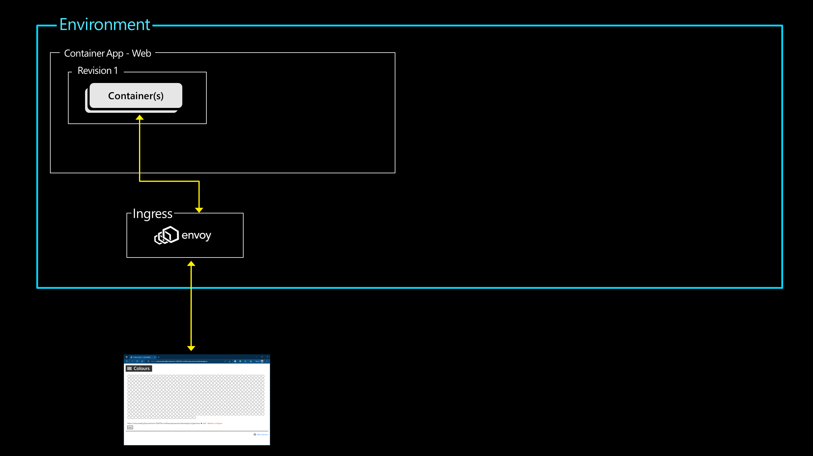
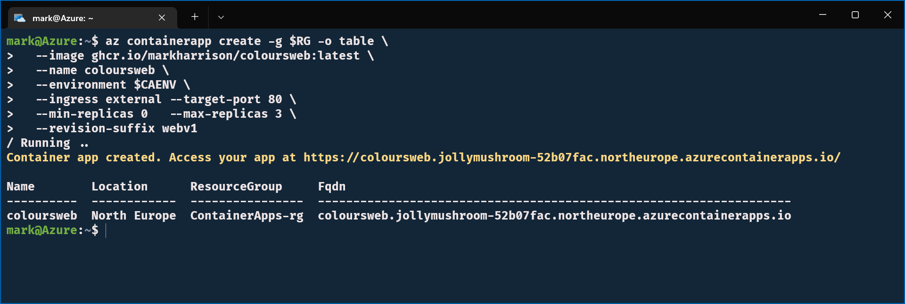
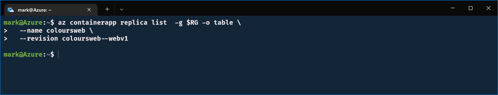
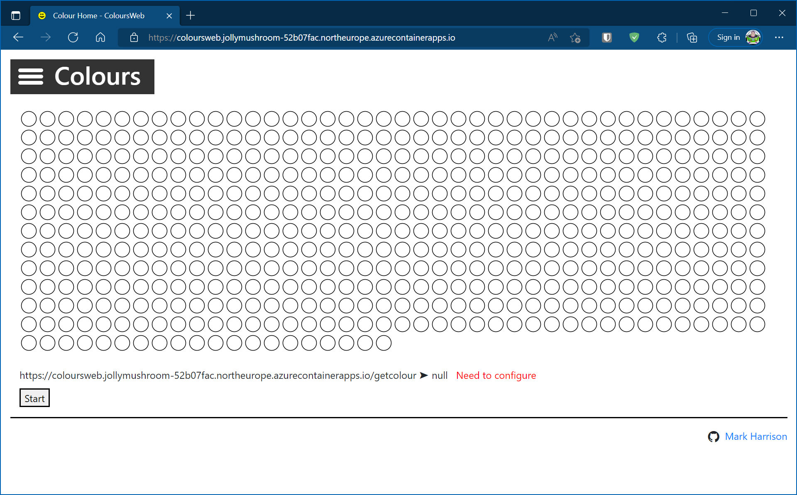
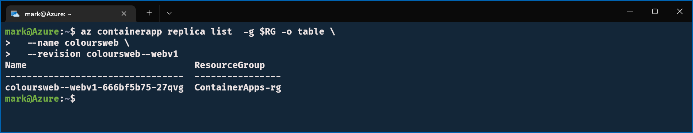
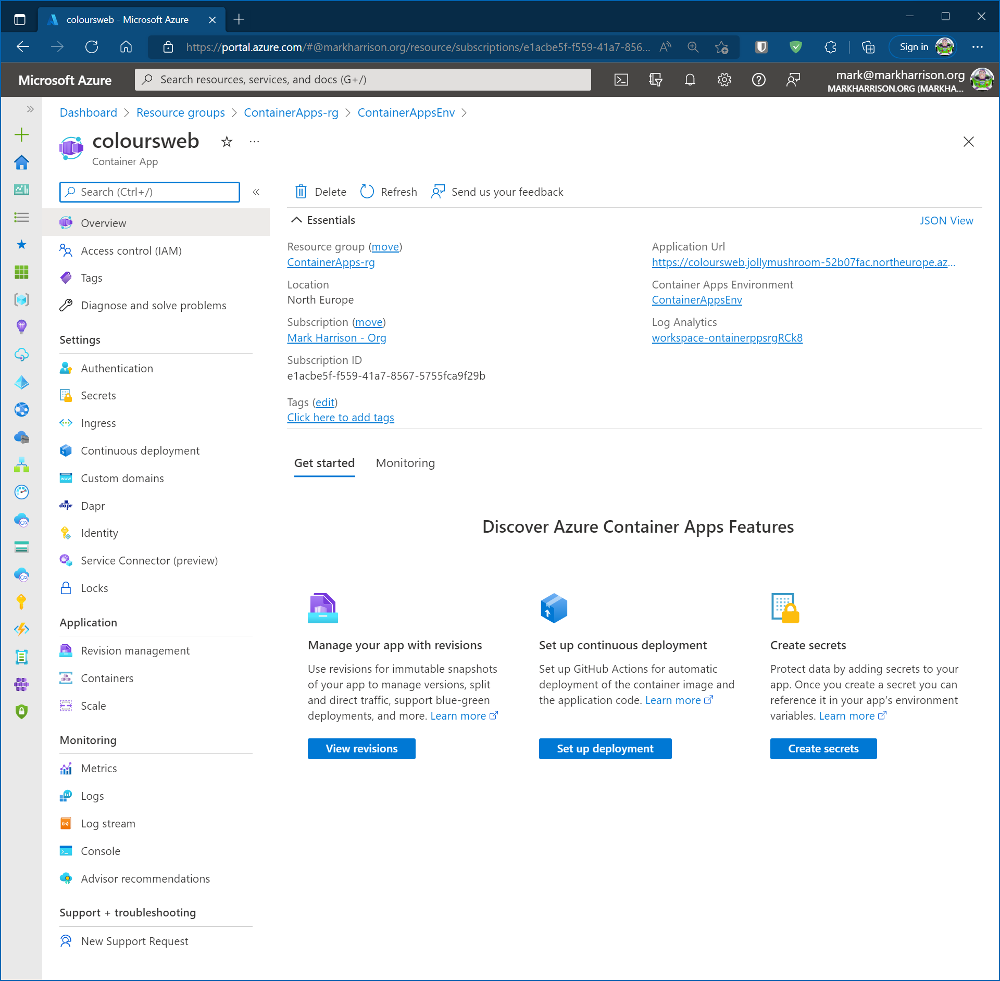
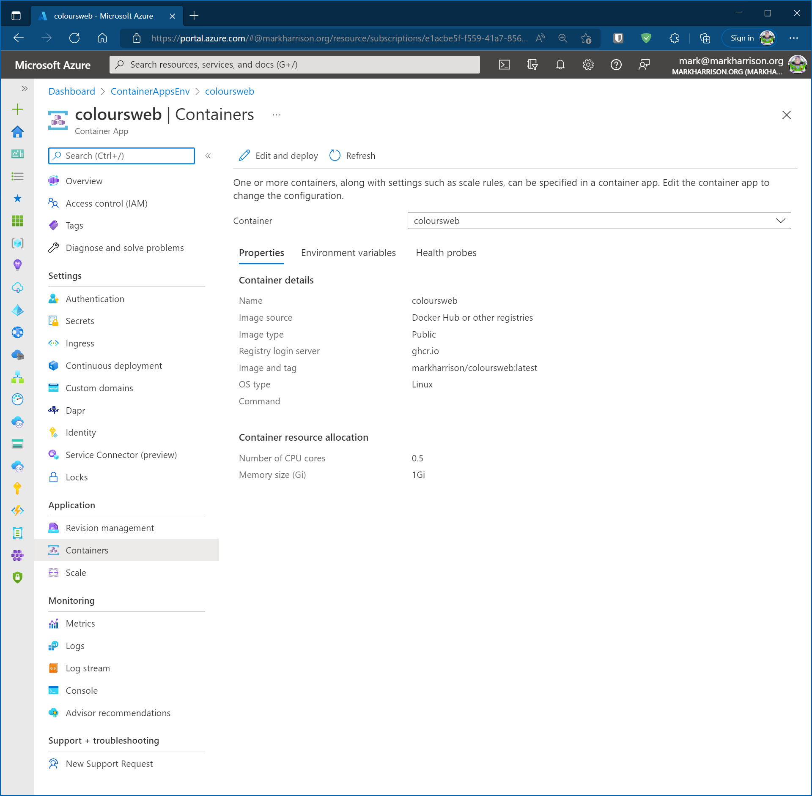

# Deploy WebApp

## Objective

In this section we will create a Container App which will be the WebApp front-end.   



## Lab Script

### Create Container App

- Create the Container App for the WebApp front-end 
  - Container image is pulled from the GitHub container registry
  - Specify that it can be externally accessed
  - Specify that it can scale from 0 to 3 container instances (replicas) 

```
az containerapp create -g $RG -o table \
  --image ghcr.io/markharrison/coloursweb:latest \
  --name coloursweb \
  --environment $CAENV \
  --ingress external --target-port 80 \
  --min-replicas 0   --max-replicas 3 \
  --revision-suffix webv1 
``` 

 

Note the name of the URL that is emitted - in the above example it is:

`https://coloursweb.jollymushroom-52b07fac.northeurope.azurecontainerapps.io/`

### Auto Scale Up / Down

- Check how many replicas (container instances) are running

```
az containerapp replica list  -g $RG -o table \
  --name coloursweb \
  --revision coloursweb--webv1
```


- Wait for 5 minutes - after no activity, it should scale down to zero replicas



- Access the web site - in a web browser go to the URL that was emitted when the container app was created 



- Accessing the site will cause one replica to be spun up to service the request.



### Explore Azure Portal

- In the Azure portal we can see the Container App.  Explore the various menu options.





## Summary 

In this section we created our first application - the Web front-end. 

The number of replicas automatically scaled as needed and went down to zero when not used.   No usage charges apply when an application is scaled to zero.
