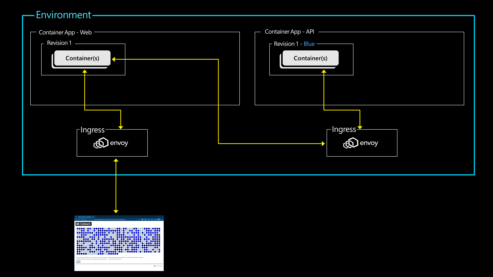
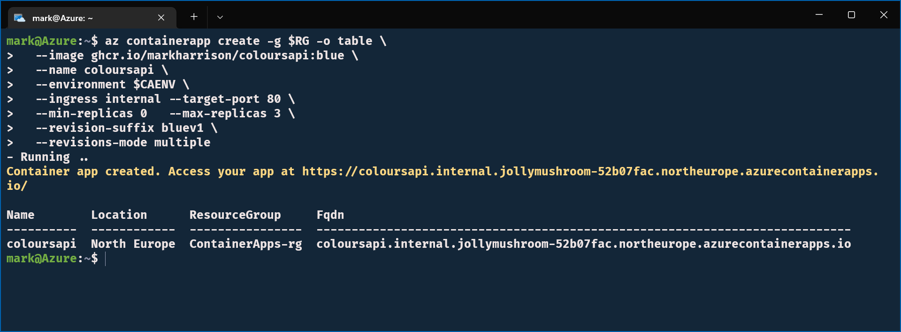
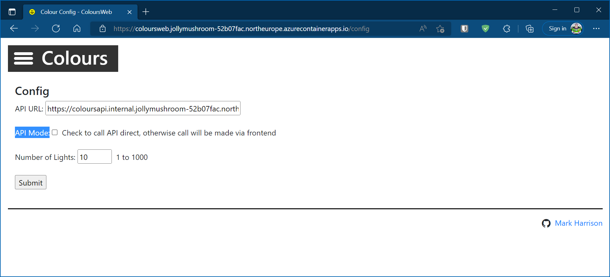
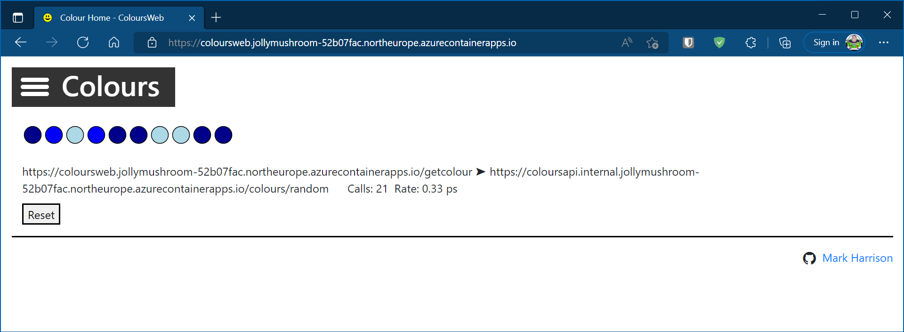
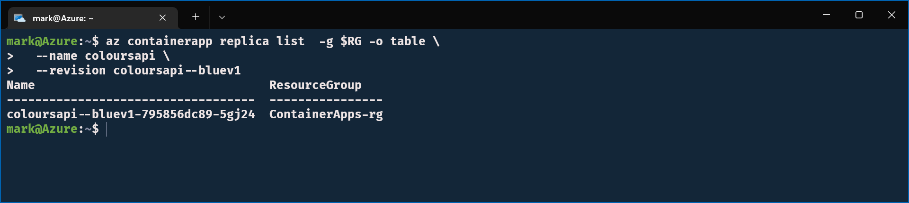
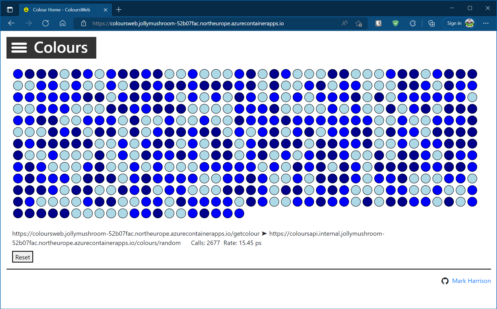
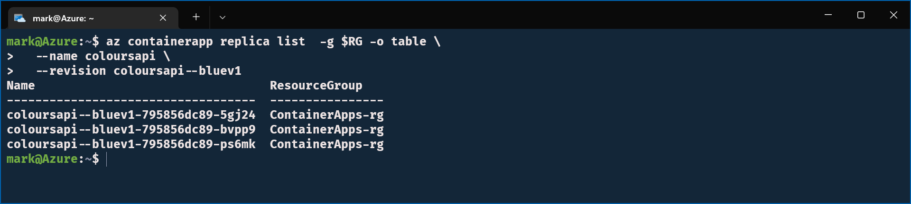
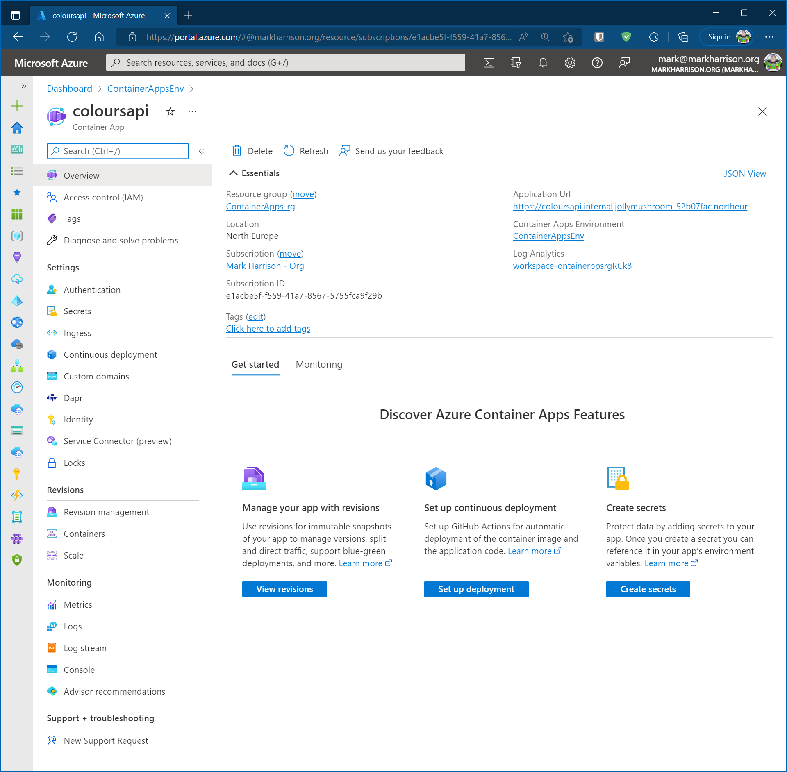
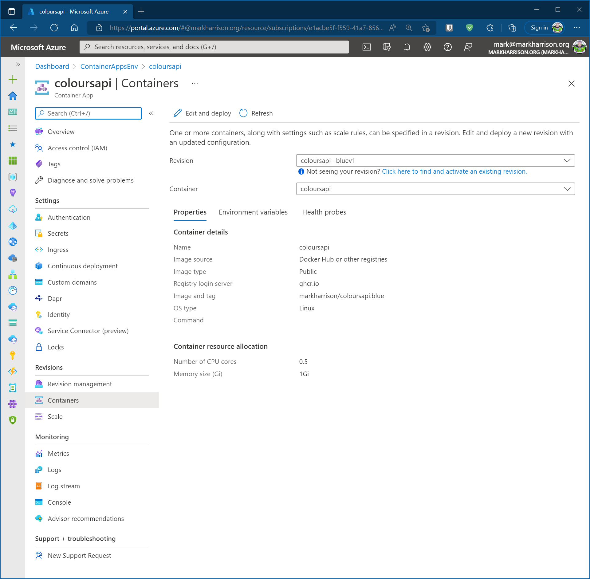

# Deploy APIApp

## Objective

In this section we will create a Container App which will be the APIApp.  The WebApp that we create in the previous section will communicate with the APIApp.

The APIApp will not be exposed outside of the Container Apps Environment.

We will put the APIApp under a heavy workload and see how it scales-out.



## Lab Script

### Create Container App

- Create the Container App for the APIApp 
  - Container image is pulled from the GitHub container registry
  - Specify that it can only be internally accessed - not exposed outside of the Container Apps Environment
  - Specify that it can scale from 0 to 3 container instances (replicas) 
  - Specify revisions mode of 'multiple' - this allows a Container App to have more than one Container Image active

```
az containerapp create -g $RG -o table \
  --image ghcr.io/markharrison/coloursapi:blue \
  --name coloursapi \
  --environment $CAENV \
  --ingress internal --target-port 80 \
  --min-replicas 0   --max-replicas 3 \
  --revision-suffix bluev1 \
  --revisions-mode multiple  
```



Note the name of the URL that is emitted - in the above example it is:

`https://coloursapi.internal.jollymushroom-52b07fac.northeurope.azurecontainerapps.io/`

### Auto Scale Up / Down

- Check number of replicas

```
az containerapp replica list  -g $RG -o table \
  --name coloursapi \
  --revision coloursapi--bluev1
```


- Return to the web browser - and using the menu select Config (access via top left burger icon)
- Enter the following values:
  - API URL - set to the internal URL of the API app + "/colours/random" ... e.g. https://coloursapi.internal.jollymushroom-52b07fac.northeurope.azurecontainerapps.io/colours/random
  - API Mode: unchecked ... the call to the API goes via the front-end container - remember the API is not exposed outside the environment
  - Number of Lights to 10 ... at this stage we want a low traffic rate 
  - Select [Submit]



- Select [Start]
- Each light will call the APIApp to get a random color - the light will then take that colour.



- Check the number of replicas ... with a low rate on the APIApp - the nunmber of replicas should be 1



- Return to config - and set the number of lights to 500



- Check the number of replicas ... with a high rate on the APIApp - the number of replicas has scaled up to the maximum of 3



### Explore Azure Portal

- In the Azure portal we can see the Container App.  Explore the various menu options.

 



## Summary 

In this section we created our second application - the APIApp.  

The Web App was configured to communicate with the APIApp ... the API returns random colours which was displayed by the WebApp. 

The number of replicas automatically scaled up when under a heavy load.
