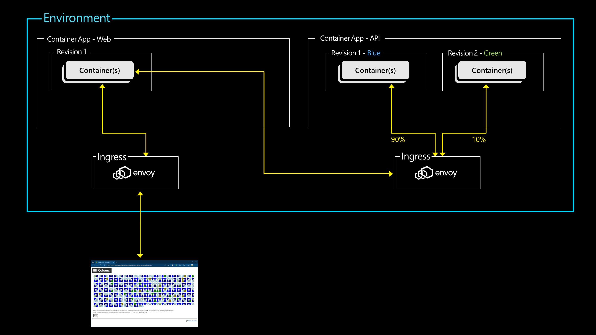
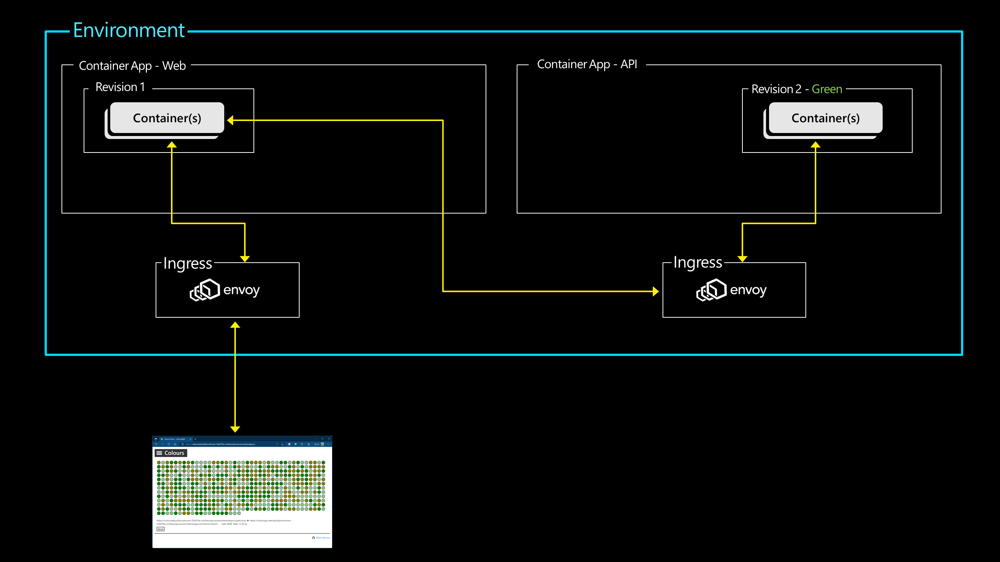
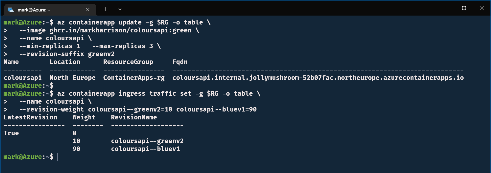
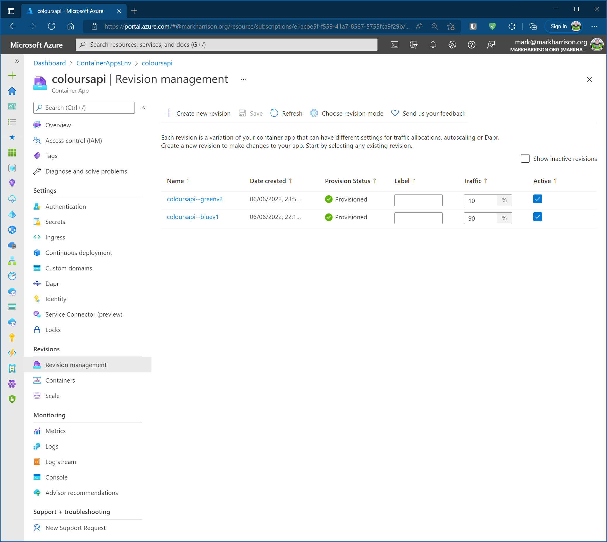
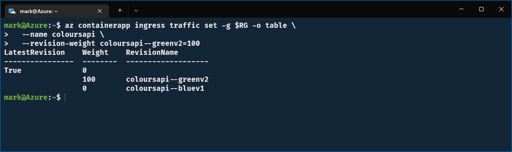
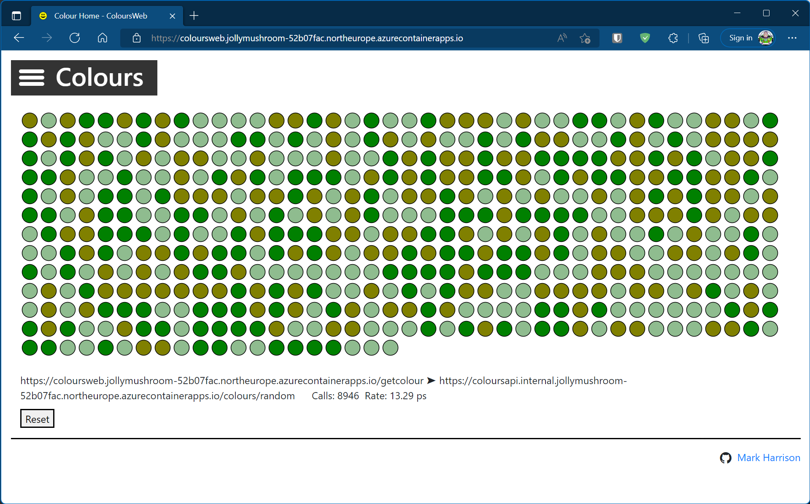
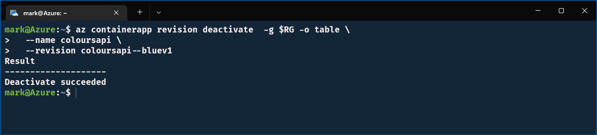
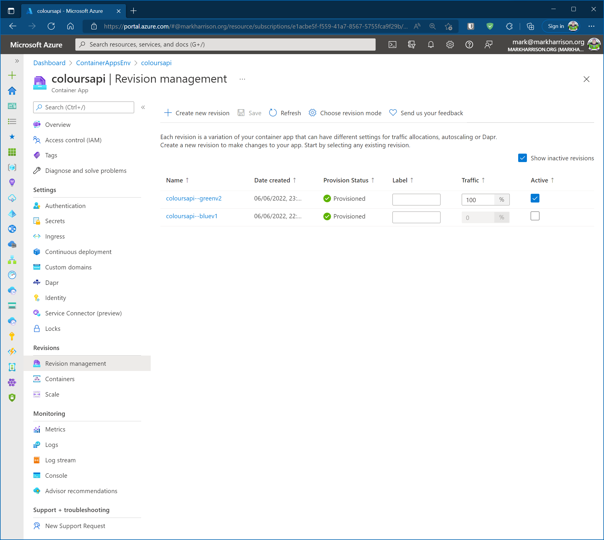

# Update APIApp

## Objective

In this section we will deploy a second Container Image to the APIApp with some new business logic.

To do some Blue/Green testing we shall send 90% of traffic to the old instance and 10% to the new instance.



When we are confident that the new business logic is working satisfactory - we shall cutover and send 100% to new Container Image.



## Lab Script

### Update Container App - V2 

- Update the APIApp Container Image with V2 business logic
- Immediately amend the ingress rule to split the traffic 10%:90% (new:old)

```
az containerapp update -g $RG -o table \
  --image ghcr.io/markharrison/coloursapi:green \
  --name coloursapi \
  --min-replicas 0   --max-replicas 3 \
  --revision-suffix greenv2  

az containerapp ingress traffic set -g $RG -o table \
  --name coloursapi \
  --revision-weight coloursapi--greenv2=10 coloursapi--bluev1=90
```



### Blue / Green Testing

- Check the WebApp - we should see approx 10% green and 90% blue 


- In the Azure portal we can see the two Container revisions and traffic distribution



### Cutover to V2 

- Cutover completely to the new V2 business logic

```
az containerapp ingress traffic set -g $RG -o table \
  --name coloursapi \
  --revision-weight coloursapi--greenv2=100 
```



 

- Deactive old V2 business logic

```
az containerapp revision deactivate  -g $RG -o table \
  --name coloursapi \
  --revision coloursapi--bluev1 
```






## Summary 

In this section we deployed an update V2 of our business logic.

Intially we allowed a small amount of traffic to use the new version whilst the majority used the old version.  Once satisified, we cutover fully to use the updated version.

To tidy up - delete the resource group

```
az group delete -n $RG --yes
```

