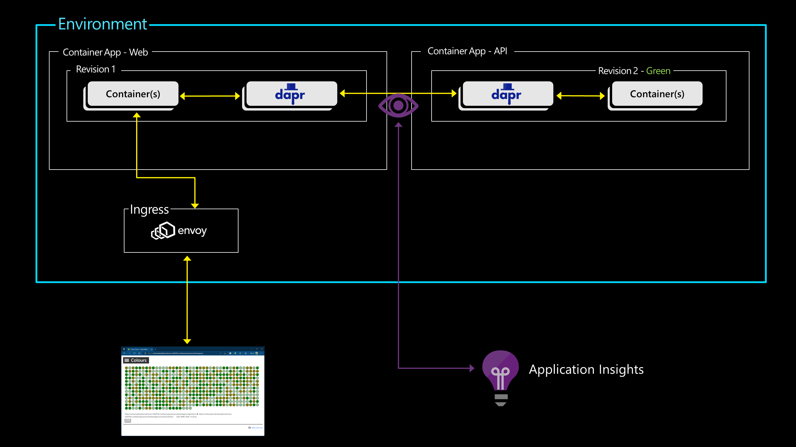
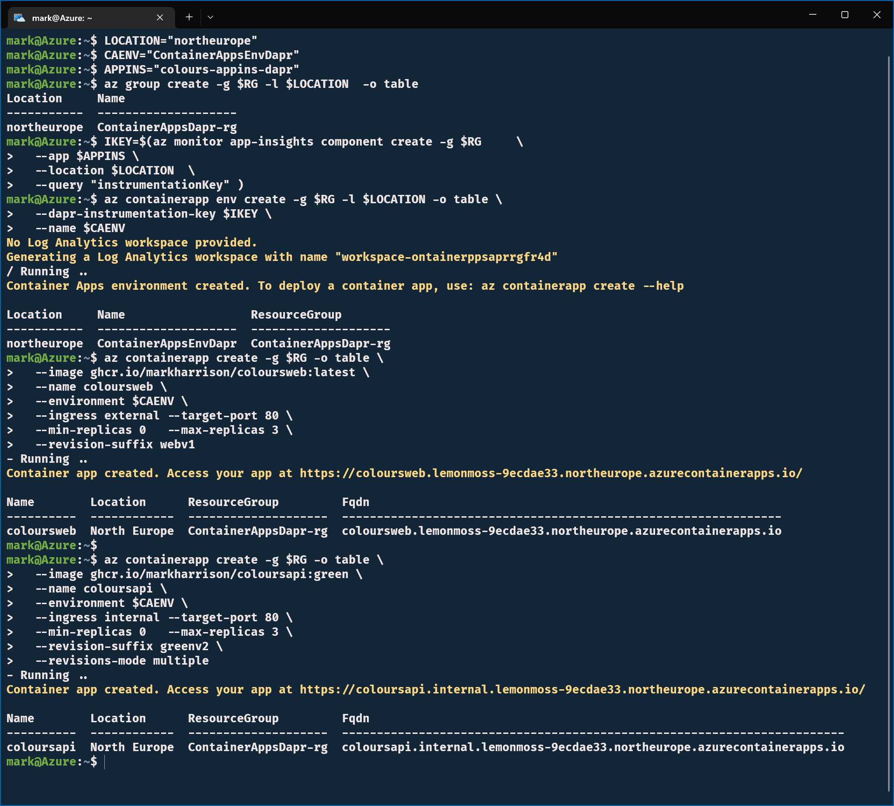
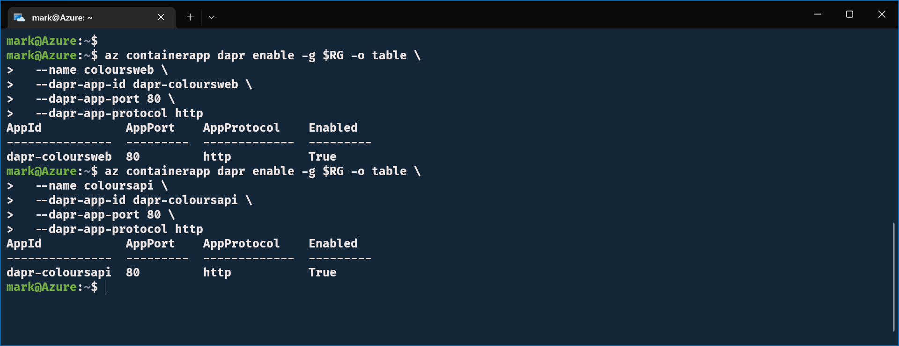
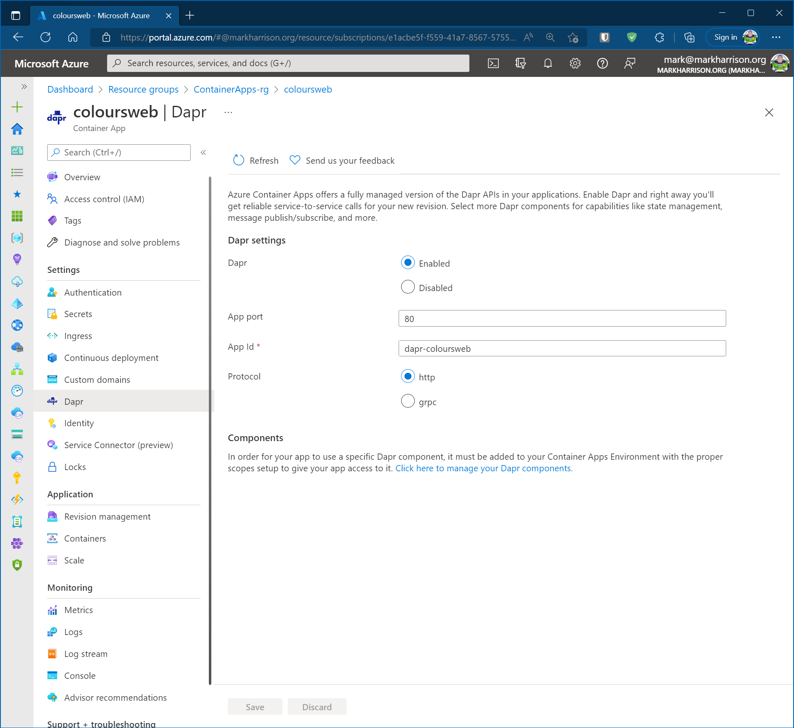
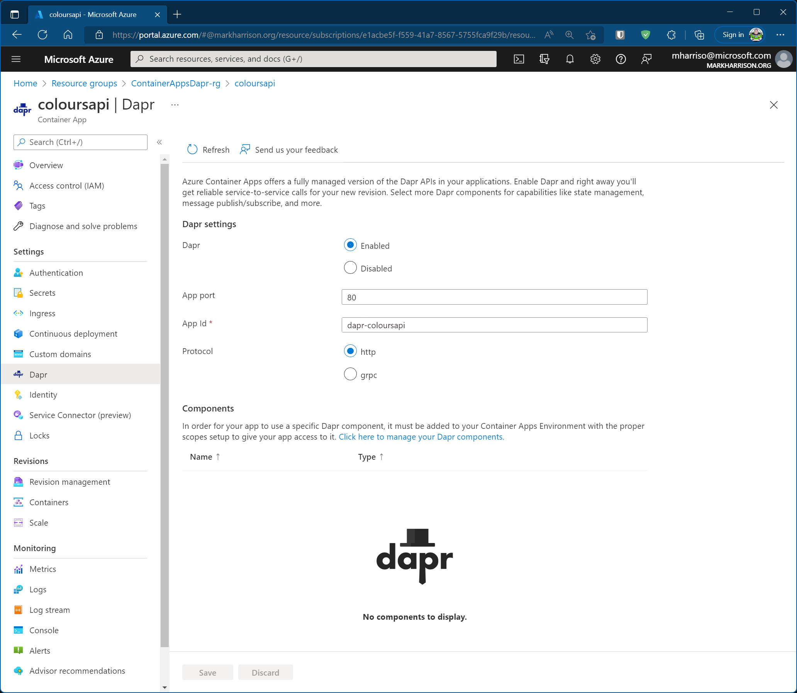
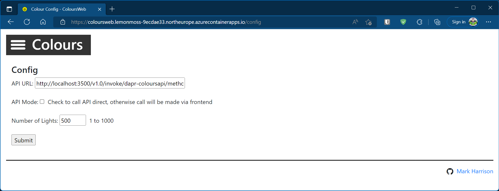
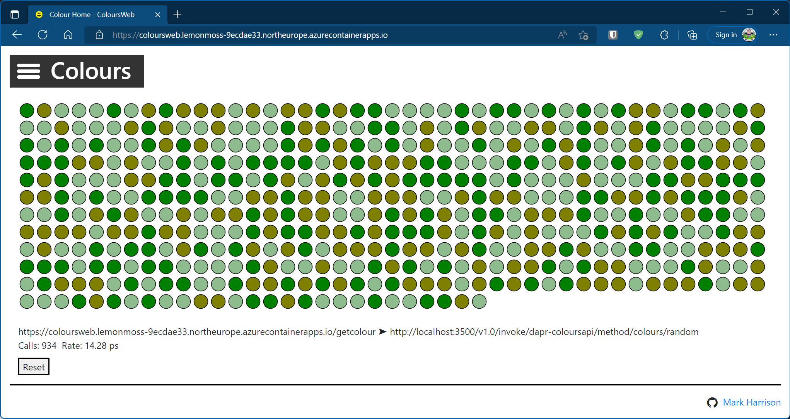
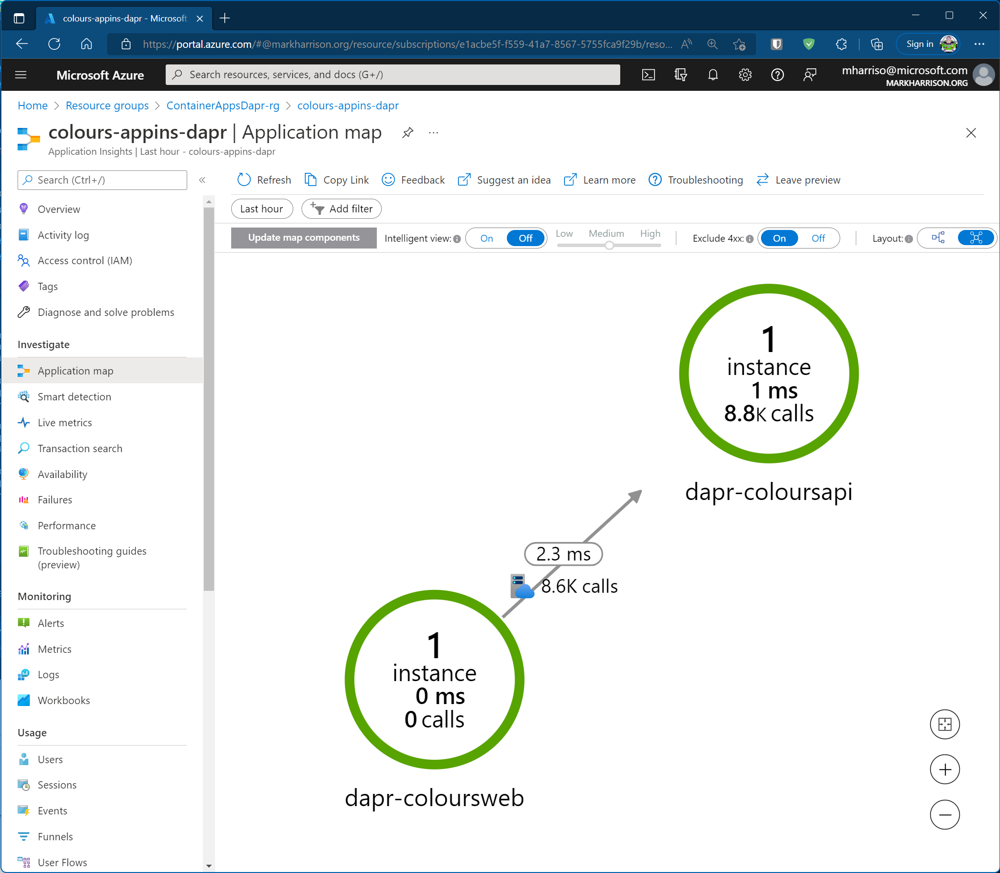
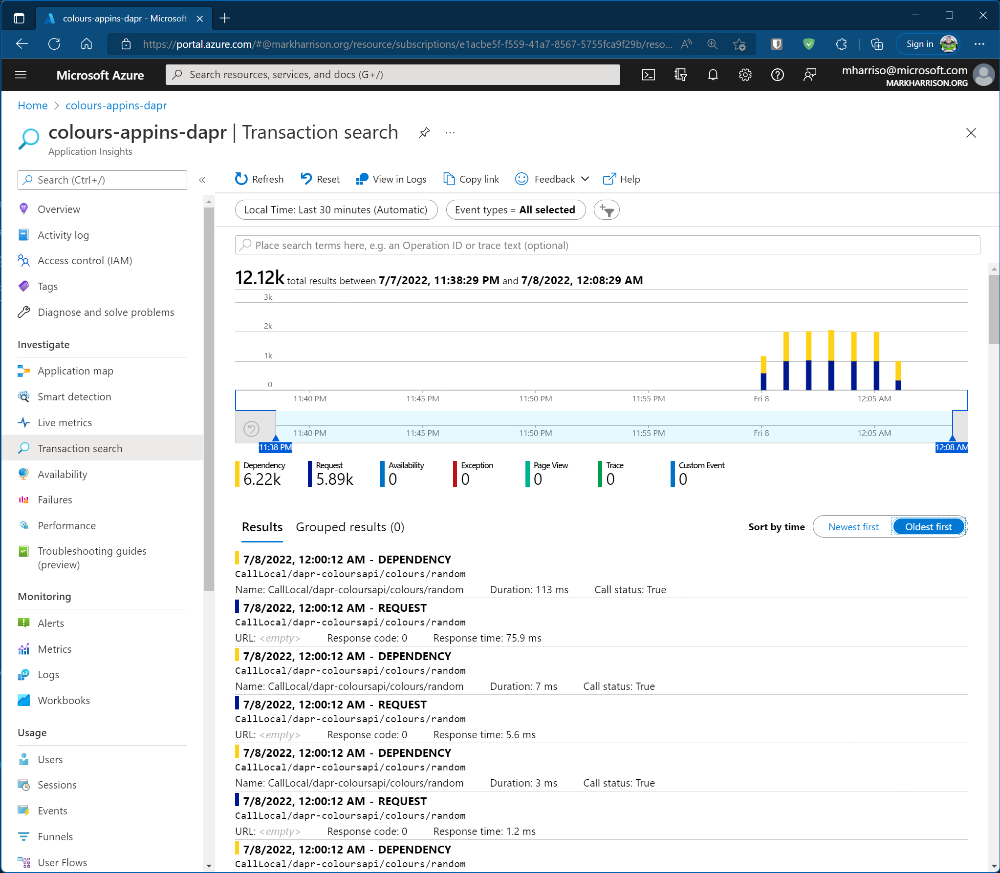
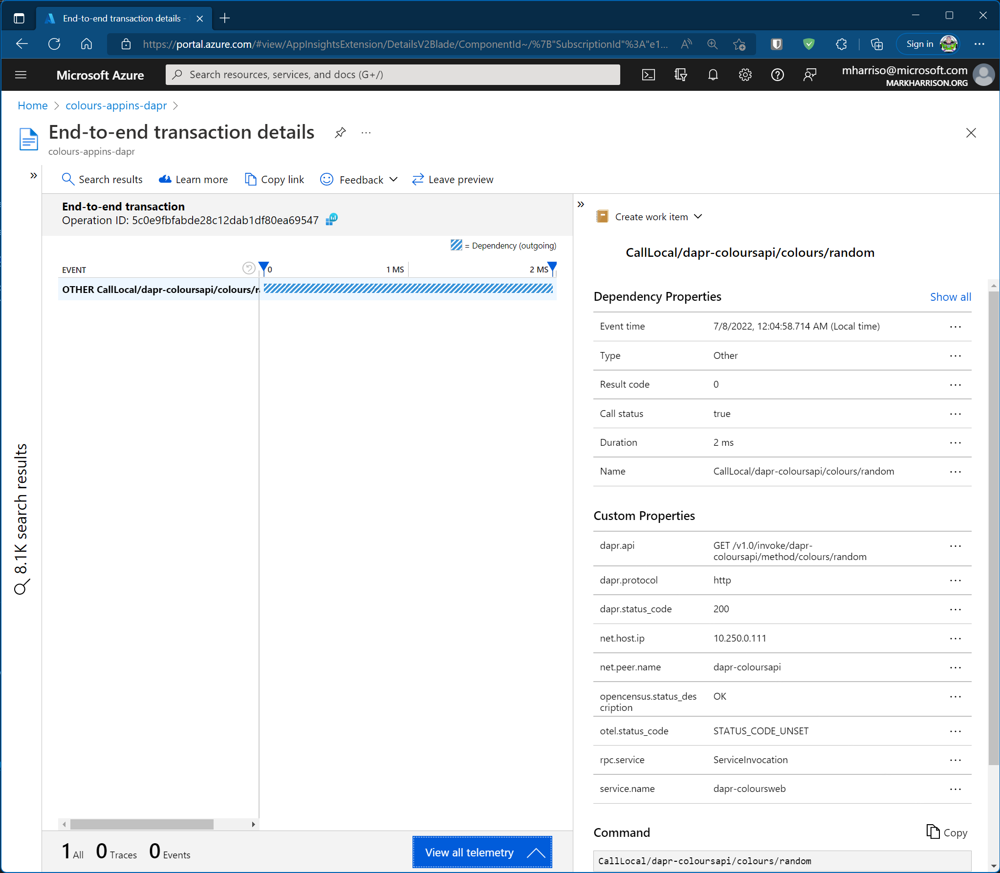

# DAPR Service Invocation

## Objective

Dapr (Distributed Application Runtime) is a runtime that helps build resilient, stateless, and stateful microservices.   This section assumes that the reader has a basic understanding of Dapr - please refer to [https://dapr.io](https://dapr.io).

Dapr uses the 'Sidecar Pattern' which extracts the common concerns from a service and host them separately in a separate process / container. In the diagram below we see the Dapr functionality is located in an additional container that works alongside our application container.

In this section we shall enable Dapr to handle service invocation between our two containers.
The advantages this offers includes:
- Service discovery using name resolution.
- Secure inter-service communication using mutual (mTLS) authentication.
- Automatically handle retries and transient errors.
- Calls between applications are traced and metrics are gathered to provide insights / diagnostics - there is support for several tracing backends and OpenTelemetry collectors.



## Lab Script

### Redeploy Application 

To provide Dapr tracing using Application Insights, we need to specify the Application Insights instrumentation key to the Container Apps Environment.  

Currently, AZ CLI cannot update an existing Container Apps Environment so we will need to redeploy our application from scratch but this time specifying the Application Insights instrumentation key.

- Set up some variables for our configuration
- Create a Resource Group - this will be a boundary for all the resources we create.    At the end we can tidy up by deleting the Resource Group.

```
RG="ContainerAppsDapr-rg"
LOCATION="northeurope"
CAENV="ContainerAppsEnvDapr"
APPINS="colours-appins-dapr"
az group create -g $RG -l $LOCATION  -o table
```

- Create an Application Insights instance - get the instrumentation key and store in variable

```
IKEY=$(az monitor app-insights component create -g $RG \
  --app $APPINS \
  --location $LOCATION  \
  --query "instrumentationKey" )
```

- Create the Container Apps Environment - specifying the instrumentation key for Dapr to use

```
az containerapp env create -g $RG -l $LOCATION -o table \
  --dapr-instrumentation-key $IKEY \
  --name $CAENV 
``` 

- Redeploy our containers to the new environment

```
az containerapp create -g $RG -o table \
  --image ghcr.io/markharrison/coloursweb:latest \
  --name coloursweb \
  --environment $CAENV \
  --ingress external --target-port 80 \
  --min-replicas 0   --max-replicas 3 \
  --revision-suffix webv1 

az containerapp create -g $RG -o table \
  --image ghcr.io/markharrison/coloursapi:green \
  --name coloursapi \
  --environment $CAENV \
  --ingress internal --target-port 80 \
  --min-replicas 0   --max-replicas 3 \
  --revision-suffix greenv2 \
  --revisions-mode multiple  
```



We are now in a similar position to the end of the previous section - but this time we have an Application Insights wired up for Dapr.

### Enable DAPR

- Enable Dapr sidecar on the WebApp container.  The app-id is what Dapr uses for service discovery.  The port number is what our WebApp is listening to.

```
az containerapp dapr enable -g $RG -o table \
  --name coloursweb \
  --dapr-app-id dapr-coloursweb \
  --dapr-app-port 80 \
  --dapr-app-protocol http   
```

- Enable Dapr sidecar on the APIApp container.  The app-id is what Dapr uses for service discovery.  The port number is what our APPApp is listening to.

```
az containerapp dapr enable -g $RG -o table \
  --name coloursapi \
  --dapr-app-id dapr-coloursapi \
  --dapr-app-port 80 \
  --dapr-app-protocol http   
```



Dapr can be seen as enabled with the Azure portal.





### Service Invocation

The Web App configuration needs to be configured to an URL that forces it to use the sidecar to invoke the API.   It is explained here [https://docs.dapr.io/reference/api/service_invocation_api/](https://docs.dapr.io/reference/api/service_invocation_api/).

- Fire up the web browser to access the WebApp - and using the menu select Config (access via top left burger icon)
- Enter the following values:
  - API URL - set to sidecar ... need to use [http://localhost:3500/v1.0/invoke/dapr-coloursapi/method/colours/random](http://localhost:3500/v1.0/invoke/dapr-coloursapi/method/colours/random)
    - 3500 is the port that the Dapr sidecar uses by default in Azure Container Apps.  
    - dapr-coloursapi is the app-id that we assigned to the APIApp sidecar ... this is how the WebApp sidecar routes to the correct target sidecar. 
    - Anything specified after /method/ is the API route.  Remember from the previous sections that we used "/colours/random". 
  - API Mode: unchecked 
  - Select [Submit]





### Application Insights  

- Explore the tranactions recorded by Application Insights 
- Start with Application Map - each node on the map represents an application component.  Application Map helps you spot performance bottlenecks or failure hotspots across all components of your distributed application. 



- Next look at Transactions.   Dependency transactions are requests from ColoursWeb .   Requests transactions are requests received by ColoursAPI . 



- Select a transaction and drill down.




## Summary 

In this section we enabled Dapr.  The client container called the API container using the Dapr service invocation functionality.  

We then looks at the tracing captured by Application Insights - this is used to ensure there was no performance anomalies and can help diagnose any issues encountered.

To tidy up - delete the resource group

```
az group delete -n $RG --yes
```

