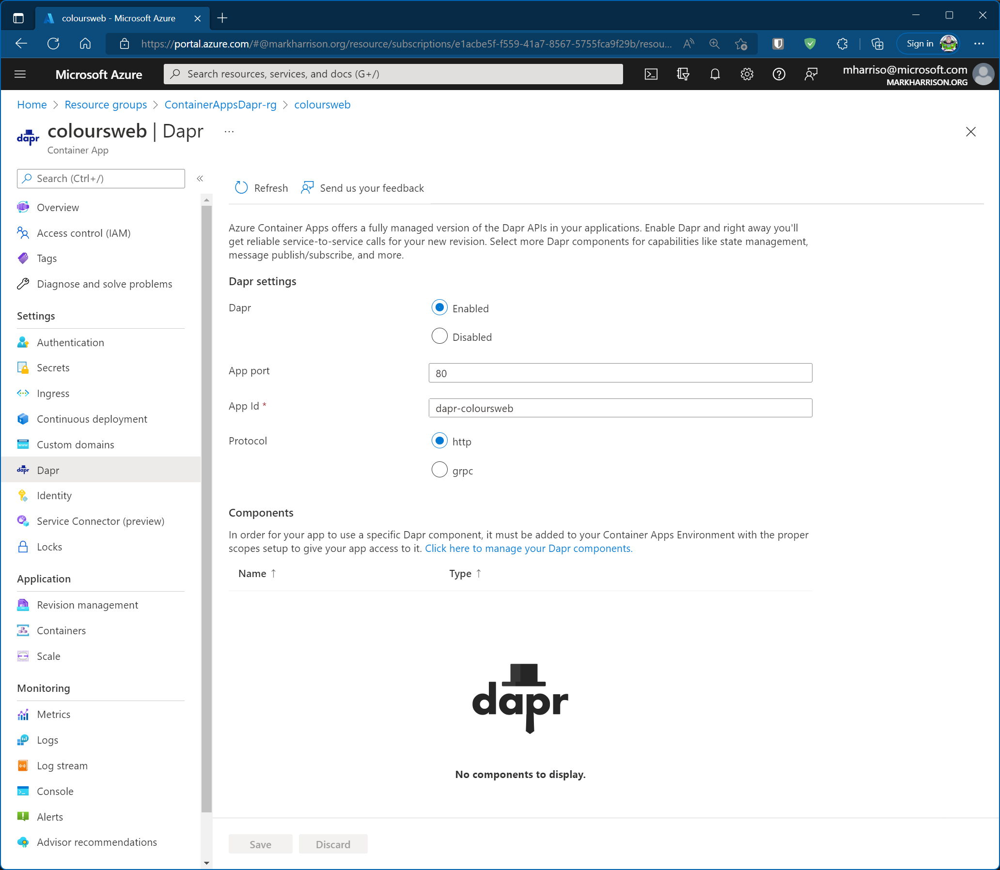

# DAPR Service Invocation

## Objective

Dapr (Distributed Application Runtime) is a runtime that helps build resilient, stateless, and stateful microservices.   This section assumes that the reader has a basic understanding of Dapr - please refer to <https://dapr.io>.

Dapr uses the 'Sidecar Pattern' which extracts the common concerns from a service and host them separately in a separate process / container. In the diagram below we see the Dapr functionality is located in an additional container that works alongside our application container.

In this section we shall enable Dapr to handle service invocation between our two containers.
The advantages this offers includes:
- Service discovery using name resolution.
- Secure inter-service communication using mutual (mTLS) authentication.
- Automatically handle retries and transient errors.
- Calls between applications are traced and metrics are gathered to provide insights / diagnostics - there is support for several tracing backends and OpenTelemetry collectors.


## Lab Script

### Enable DAPR

- Enable Dapr sidecar on the WebApp container.  The app-id is what Dapr uses for service discovery.  The port number is what our WebApp is listening to.

```
az containerapp dapr enable -g $RG -o table \
  --name coloursweb \
  --dapr-app-id dapr-coloursweb \
  --dapr-app-port 80 \
  --dapr-app-protocol http   
```

- Enable Dapr sidecar on the APIApp container.  The app-id is what Dapr uses for service discovery.  The port number is what our APPApp is listening to.

```
az containerapp dapr enable -g $RG -o table \
  --name coloursapi \
  --dapr-app-id dapr-coloursapi \
  --dapr-app-port 80 \
  --dapr-app-protocol http   
```


Dapr can be seen as enabled with the Azure portal.




### Service Invocation

The Web App configuration needs to be configured to an URL that forces it to use the sidecar to invoke the API.   It is explained here <https://docs.dapr.io/reference/api/service_invocation_api/>.

- Fire up the web browser to access the WebApp - and using the menu select Config (access via top left burger icon)
- Enter the following values:
  - API URL - set to sidecar ... need to use <http://localhost:3500/v1.0/invoke/dapr-coloursapi/method/colours/random>
    - 3500 is the port that the Dapr sidecar uses by default in Azure Container Apps.  
    - dapr-coloursapi is the app-id that we assigned to the APIApp sidecar ... this is how the WebApp sidecar routes to the correct target sidecar. 
    - Anything specified after /method/ is the API route.  Remember from the previous sections that we used "/colours/random". 
  - API Mode: unchecked 
  - Select [Submit]


## Summary 

In this section we enabled Dapr.  The client container called the API container using the Dapr service invocation functionality.
